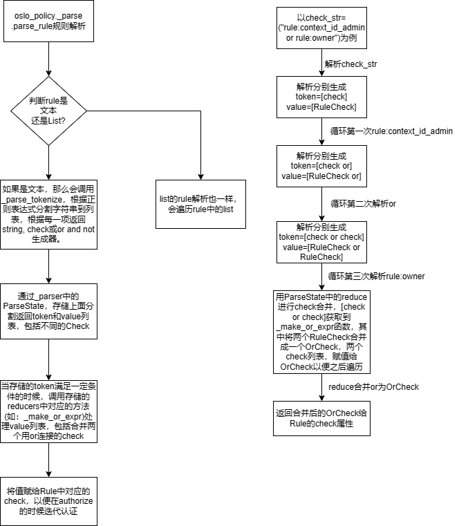

## RBAC基于角色的权限访问控制

### 一、项目介绍
本项目是对Openstack公共组件oslo中oslo.policy对项目进行基于角色的权限访问控制的验证实践。

### 二、项目概述
本项目使用http.server构建了一个简单的web server。由于安全性的考虑，http.server不适用于生成环境，因此这里只用于做测试和验证。在服务启动的时候，会通过init初始化函数去加载manager包中管理的各个组件的policy，如：neutron。其中会通过import_module函数导入组件的policy并对组件中的每个Rule进行初始化和对每个Rule进行解析。

### 三、项目流程分析



### 四、项目目录结构

```
│  base.py
│  main.py
│  policy.py
│  README.md
│  request.py
│
├─assets
│      policy-flow.drawio
│      policy-flow.drawio.png
│
├─manager
│  │  base.py
│  │  neutron.py
│  │  __init__.py
```

### 五、项目启动和结果

```
python main.py #在顶级目录启动项目

# 浏览器打开网址 http://localhost:8088/
# 获取到如下的结果
[
    {
        "rule": "context_is_admin",
        "allowed": true
    },
    {
        "rule": "owner",
        "allowed": false
    }
]
```