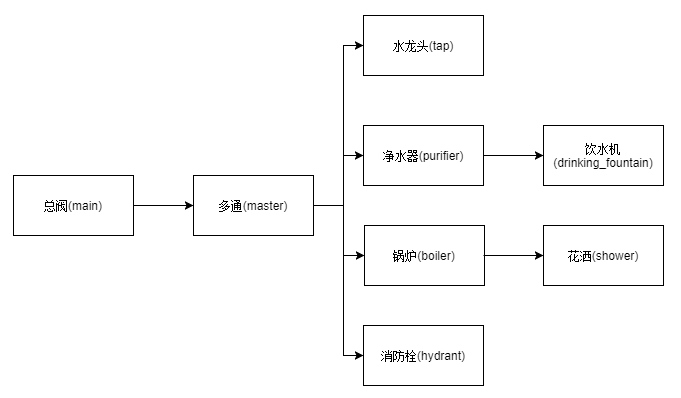

# Introduction
**This is a hands-on project for Paste+PasteDeploy.**

### Goals
The purpose of this project is to be better familiar with paste's unified configuration and management of wsgi services.

### Concept Flow Chart
```
/main/hydrant              #/总阀/消防栓
/main/tap                  #/总阀/水龙头
/main/boiler/shower        #/总阀/锅炉/花洒（淋浴房）
/main/purifier/drinking    #/总阀/净化器/直饮水机
```
Design the paste.ini configuration rules based on the above url routing rules.


### Dependency(pypi)
- Paste
- PasteDeploy

### Install Python Packages
- pip install Paste
- pip install PasteDeploy
### Usage
1、Start wsgi server
```
python main.py
```
2、Browser test url
1. http://127.0.0.1:8000/main/hydrant
2. http://127.0.0.1:8000/main/tap
3. http://127.0.0.1:8000/main/boiler/shower
4. http://127.0.0.1:8000/main/purifier/drinking

[Paste Deployment](https://pastedeploy.readthedocs.io/en/latest/)

[参考](https://blog.csdn.net/li_101357/article/details/52755367)
