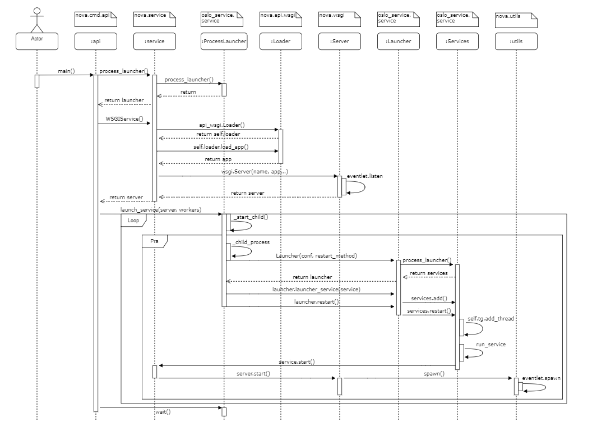
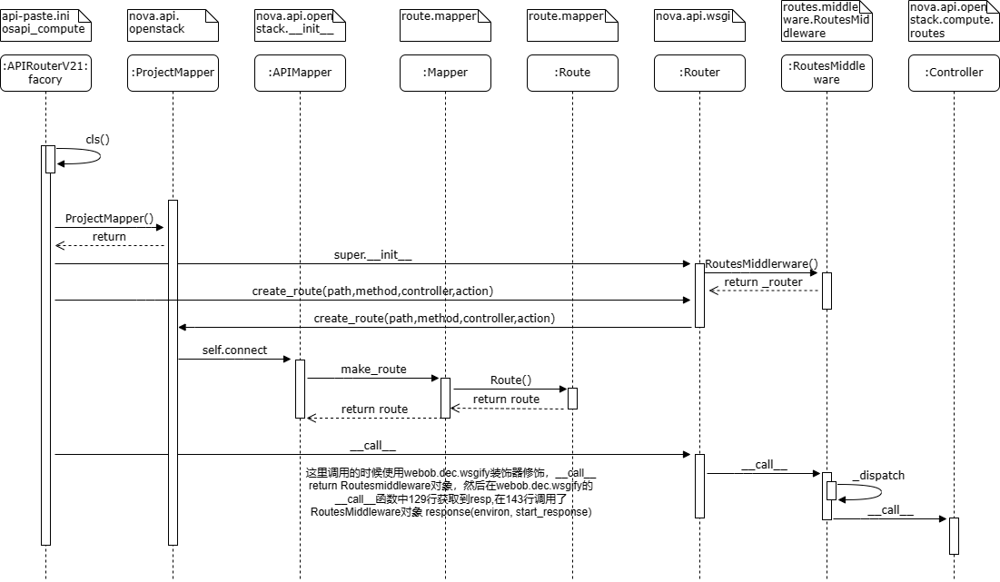

# Introduction
**This project is a practice to mimic the wsgi launch and routing process of the openstack nova-api module, including Paste、PasteDeploy、Routes and WebOb(PPRW arch-design).**

### Goals
The goal of the project is to enhance the understanding and application of the nova-api module through practice.

### Timing Chart




### Dependency(pypi)
- Paste
- PasteDeploy
- Routes
- WebOb

### Install Python Packages
- pip install Paste
- pip install PasteDeploy
- pip install Routes
- pip install Routes
### Usage
1、Start wsgi server
```
python main.py
```
2、Browser test url
1. http://127.0.0.1:9999/test1
2. http://127.0.0.1:9999/test2